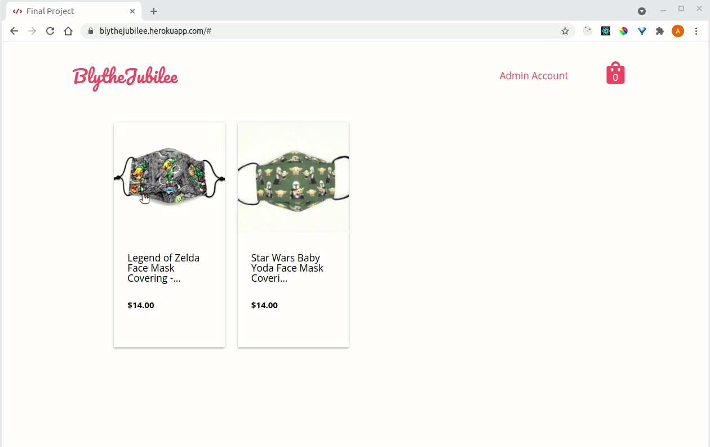
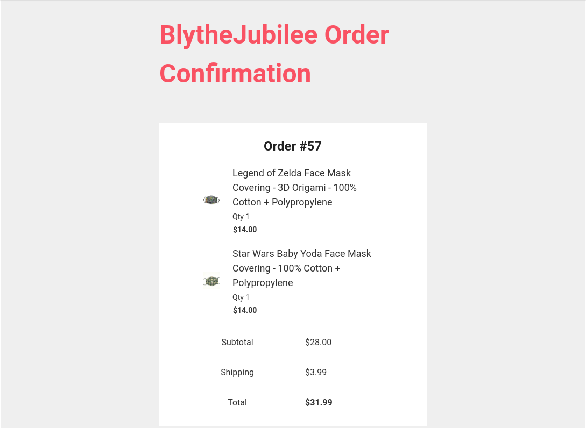

# blythejubilee

A full stack web application for people who want to buy handmade goods.

I built this app to be an independent webshop to my Etsy store. A buyer can
easily checkout goods with PayPal for quick, convenient shopping. PayPal
provides the name and shipping address of the buyer, so no personal information
is stored besides the buyer's email which the app will send a receipt to.

## Technologies Used

Frontend
- React.js
- Materialize CSS
- HTML5
- CSS3

Backend
- Webpack
- Node.js
- PostgreSQL
- NodeMailer
- Google API

Deployment
- Heroku
- Amazon S3

## Live Demo

Try the application live at [https://blythejubilee.herokuapp.com](https://blythejubilee.herokuapp.com)

Use this demo login to checkout: demouser2021@zohomail.com, Wr36&8mj5RnbzZ&

This is a PayPal sandbox account with no real funds.  You cannot login to the
PayPal website with this account. You can only use it to pay for goods in this
app.

## Features

- Admin can view the shop's items.
- Admin can add an item for sale.
- Buyer can view items for sale.
- Buyer can add an item to the shopping bag.
- Buyer can checkout shopping bag and pay with PayPal.
- Buyer receives an email with the receipt.

## Future Features

- User can login to checkout.
- Logged in users can view their orders.
- Admin can edit shop items.
- Admin can view all shop orders.


## Preview




## Development

### System Requirements

- Node.js 10 or higher
- NPM 6 or higher
- PostgreSQL

### Getting Started

1. Clone the repository.

    ```shell
    git clone git@github.com:angeljubilee/blythejubilee.git
    cd blythejubilee
    ```

1. Install all dependencies with NPM.

    ```shell
    npm install
    ```

1. Make a copy of the env example.

    ```shell
    cp .env.example .env
    ```

1. Fill in the API Keys for Google if using Gmail for your shop email and Amazon.

1. Fill in your shop's email for EMAIL_USER.

1. Update the PayPal script in index.html with your own PayPal clientId.

    ```shell
    <script
      src="https://www.paypal.com/sdk/js?client-id={PAYPAL_CLIENT_ID}">
    </script>
    ```

1. Make sure that PostgreSQL is running.

1. Create a new database for the app.
    ```shell
    createdb etsyShop
    ```

1. Import the example database.

    ```shell
    npm run db:import
    ```

1.  Start up the app.
    ```shell
    npm run build
    ```

1.  Once the app is up, you can view it in your browser at http://localhost:3000.
